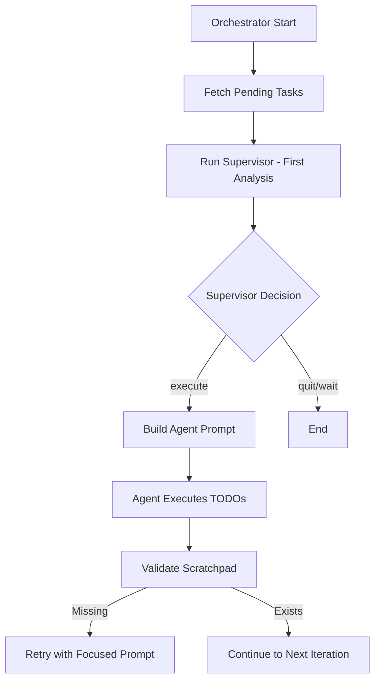
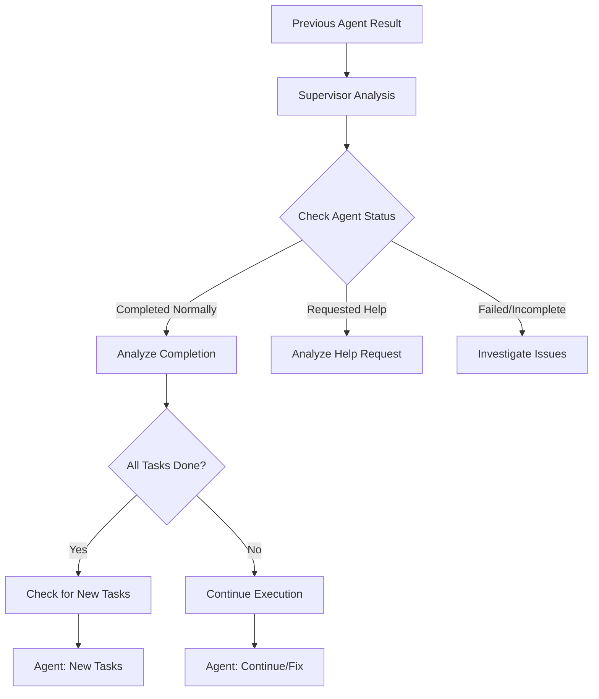
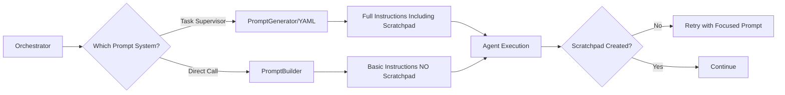

# Claude Cadence Prompt Flow Analysis

## Overview

Claude Cadence uses a sophisticated prompt orchestration system that coordinates between a supervisor and agent. This document maps out the complete flow of prompts, variables that trigger different paths, and the logic behind scratchpad creation.

## Architecture Components

### 1. Core Systems

- **YAMLPromptLoader** (`prompts.py`): Loads and formats templates from `prompts.yaml`
- **PromptGenerator** (`prompts.py`): Generates context-aware prompts using YAML templates
- **PromptBuilder** (`prompt_utils.py`): Secondary/fallback prompt builder (simpler, not YAML-based)
- **Orchestrator** (`orchestrator.py`): Manages the supervisor-agent workflow
- **TaskSupervisor** (`task_supervisor.py`): Handles supervisor-specific logic

### 2. Key Discovery: Two Prompt Systems Exist

1. **Primary System**: YAML-based (`prompts.yaml` + `PromptGenerator`)
   - Used by Task Supervisor for initial prompts
   - Rich templates with scratchpad instructions
   - Supports continuation contexts

2. **Secondary System**: Code-based (`PromptBuilder`)
   - Used by orchestrator's `build_agent_prompt` method
   - Simpler, doesn't use YAML templates
   - **Missing scratchpad instructions in some cases**

## Prompt Flow by Iteration

### Iteration 1: Initial Execution



#### Supervisor Prompt (Iteration 1)
Variables used:
- `task_id`, `task_title`
- `completed_subtasks`, `total_subtasks`
- `pending_todos` (list of subtasks)

Template structure:
```yaml
You are an AI supervisor analyzing tasks for execution.

Current Task: {task_id} - {task_title}
Progress: {completed_subtasks}/{total_subtasks} subtasks complete

Pending Subtasks:
{pending_todos}

Analyze and decide:
1. Should agent execute? (should_execute: true/false)
2. Specific guidance for success
3. Reasoning for decision
4. Need for assistance? (needs_assistance: true/false)
```

#### Agent Prompt (Iteration 1)
**Critical Issue Found**: The prompt depends on which system is used:

**If using PromptGenerator (YAML-based)** - Includes scratchpad instructions:
```yaml
=== SUPERVISED AGENT CONTEXT ===
[Role explanation]

EXECUTION GUIDELINES:
1. FIRST ACTION: Create your scratchpad file
   - Create directory: .cadence/scratchpad/
   - Create file: .cadence/scratchpad/session_{session_id}.md
   - Initial content: [template provided]

2. TASK MASTER INTEGRATION: [instructions]
3. [Other guidelines...]

=== YOUR TODOS ===
[List of tasks]
```

**If using PromptBuilder (code-based)** - Missing scratchpad instructions:
```
=== TASK MASTER INFORMATION ===
[Task info if available]

=== SUPERVISOR GUIDANCE ===
[Guidance from supervisor]

=== TASK EXECUTION GUIDELINES ===
[Basic guidelines WITHOUT scratchpad instructions]

=== YOUR TODOS ===
[List of tasks]
```

### Iteration 2+: Continuation



#### Supervisor Prompt (Iteration 2+)
Additional variables:
- `previous_agent_result` (success, execution_time, etc.)
- `agent_completed_normally`
- `agent_requested_help`
- `scratchpad_content` (if available)

Template additions:
```yaml
Previous Execution:
- Success: {success}
- Execution Time: {execution_time}s
- Completed Normally: {completed_normally}
- Requested Help: {requested_help}

{if scratchpad_exists}
Agent's Scratchpad:
{scratchpad_content}
{else}
WARNING: Agent did not create required scratchpad
Check agent logs for issues
{endif}
```

#### Agent Prompt (Continuation)
Variables determining continuation type:
- `continuation_type`: complete_new_tasks, fixing_issues, or incomplete
- `supervisor_analysis` object
- `previous_scratchpad_content`

## Scratchpad Creation Logic

### Why Scratchpads Are Sometimes Created, Sometimes Not

1. **When Using PromptGenerator (YAML)**: Instructions are included but can be missed because:
   - They're buried in a large block of guidelines
   - Agent may prioritize TODOs over "FIRST ACTION"
   - Complex prompts can lead to instruction skipping

2. **When Using PromptBuilder**: Instructions are NOT included at all
   - This happens when orchestrator calls `build_agent_prompt` directly
   - Used for quick fixes, bug corrections, etc.

3. **Success Factors**:
   - Clear, prominent placement of instructions
   - Shorter overall prompt length
   - Explicit supervisor guidance mentioning scratchpad

### Scratchpad Retry Mechanism

When scratchpad is missing:
```python
# Up to 5 retry attempts
for attempt in range(5):
    if not scratchpad_exists:
        # Use focused prompt with ONLY scratchpad instructions
        retry_prompt = """
        URGENT: You failed to create scratchpad.
        
        Your ONLY task:
        1. Create: {project_root}/.cadence/scratchpad/session_{session_id}.md
        2. Include: [specific content template]
        
        CRITICAL: Use exact absolute path provided.
        """
```

## Variables That Trigger Different Prompts

### Supervisor Variables

1. **`has_previous_agent_result`**: Boolean
   - True: Include previous execution analysis
   - False: First-time task analysis

2. **`agent_completed_normally`**: Boolean  
   - True: Focus on completion verification
   - False: Investigate what went wrong

3. **`agent_requested_help`**: Boolean
   - True: Analyze help request, provide guidance
   - False: Standard analysis

4. **`scratchpad_exists`**: Boolean
   - True: Include scratchpad content in analysis
   - False: Add warning about missing scratchpad

5. **`needs_assistance`**: Boolean (output)
   - True: Triggers Zen assistance integration
   - False: Standard execution

### Agent Variables

1. **`continuation_context`**: String or None
   - Present: This is a continuation run
   - None: This is initial execution

2. **`task_id`** and **`subtasks`**: Task Master integration
   - Present: Include Task Master tools and instructions
   - None: Basic TODO execution

3. **`zen_assistance`**: In guidance text
   - Present: Add special Zen reminder section
   - Absent: Standard execution

4. **`max_turns`**: Integer
   - Affects safety limit message
   - Default: 80 turns

## Critical Findings

### 1. Prompt System Mismatch
- Task Supervisor uses YAML-based system with full instructions
- Orchestrator sometimes uses PromptBuilder without scratchpad instructions
- This explains inconsistent scratchpad creation

### 2. Scratchpad Instructions Placement
- In YAML system: Included but buried in guidelines
- In PromptBuilder: Not included at all
- Retry mechanism: Clear and focused (works well)

### 3. Context Loss Between Systems
- Supervisor builds rich prompts with YAML
- Agent might receive simplified prompts from PromptBuilder
- Critical instructions can be lost in translation

## Recommendations

1. **Standardize on YAML System**: Always use PromptGenerator for agent prompts
2. **Elevate Scratchpad Instructions**: Move to top of prompt, make more prominent
3. **Add Validation**: Check which prompt system is being used
4. **Enhance Logging**: Log which prompt builder was used for debugging

## Code Flow Diagram



## Conclusion

The Claude Cadence prompt system is sophisticated but has a critical flaw: two different prompt generation systems that don't provide consistent instructions. The YAML-based system includes scratchpad instructions (though they could be more prominent), while the PromptBuilder system omits them entirely. This explains why scratchpads are sometimes created and sometimes not - it depends on which code path generates the agent prompt.