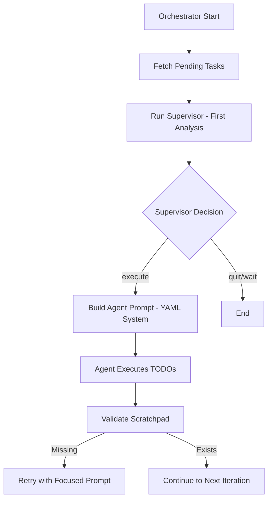
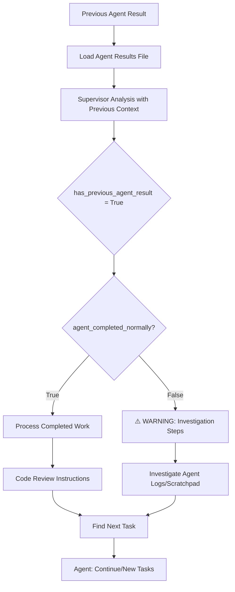
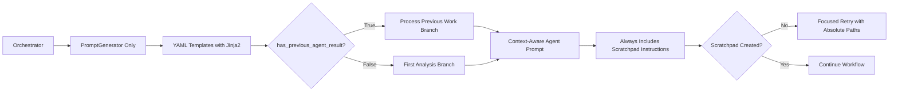

# Claude Cadence Prompt System - Complete Guide

## Table of Contents

1. [Executive Summary](#executive-summary)
2. [System Architecture](#system-architecture) 
3. [Prompt Flow by Iteration](#prompt-flow-by-iteration)
4. [Comprehensive Variable Analysis](#comprehensive-variable-analysis)
5. [Jinja2 Conditional Logic](#jinja2-conditional-logic)
6. [Template Processing Architecture](#template-processing-architecture)
7. [Scratchpad Creation System](#scratchpad-creation-system)
8. [Integration Points](#integration-points)
9. [Technical Reference](#technical-reference)
10. [Troubleshooting Guide](#troubleshooting-guide)

## Executive Summary

Claude Cadence uses a sophisticated YAML-based prompt orchestration system that coordinates between a supervisor and agent. After the YAML migration, the system now uses **unified YAML templates** with Jinja2 conditional logic for all prompt generation, ensuring consistent scratchpad instructions across all agent prompts.

**Key Achievement**: Successfully migrated from a dual prompt system to a unified YAML-based architecture, resolving scratchpad instruction inconsistencies and providing sophisticated conditional logic for context-aware prompting.

## System Architecture

### 1. Core Components (After YAML Migration)

- **YAMLPromptLoader** (`prompts.py`): Loads and formats templates from `prompts.yaml` with Jinja2 processing
- **PromptGenerator** (`prompts.py`): Generates context-aware prompts using YAML templates (PRIMARY)
- **SupervisorOrchestrator** (`orchestrator.py`): Manages the supervisor-agent workflow using YAML system
- **TaskSupervisor** (`task_supervisor.py`): Handles supervisor-specific logic
### 2. Unified YAML-Based System

**✅ COMPLETE**: All components now use the unified YAML-based prompt system.

**System Components**: YAML-based (`prompts.yaml` + `PromptGenerator` + `YAMLPromptLoader`)
- **ALL COMPONENTS** use YAML templates - orchestrator and task_supervisor
- Rich templates with comprehensive scratchpad instructions
- Jinja2 conditional logic for sophisticated branching
- Consistent variable substitution and template resolution
- Dedicated YAML templates for all prompt generation scenarios

### 3. Three-Layer Processing Architecture

```
YAMLPromptLoader (template loading + Jinja2) 
    ↓
PromptGenerator (context building + section assembly)
    ↓  
SupervisorOrchestrator (variable setting + template selection)
```

## Prompt Flow by Iteration

### Iteration 1: Initial Execution



#### Supervisor Prompt (Iteration 1) 
**Template**: `supervisor_prompts.orchestrator_taskmaster.base_prompt`

**Key Variables Set** (orchestrator.py:518-529):
- `project_root`: Absolute path to project
- `session_id`: Generated timestamp-based ID
- `has_previous_agent_result`: `False` (first iteration)
- `agent_completed_normally`: `False` (no previous run)
- `max_turns`: From config (default: 80)

**Jinja2 Conditional Logic**:
```yaml

TASK: Process the agent's completed work, then analyze the current task state and decide what to do next.

TASK: Analyze the current task state and decide what the agent should work on first.

```

**Result**: Uses **second branch** - "Analyze current task state..."

#### Agent Prompt (Iteration 1) - YAML System Only
**✅ NOW CONSISTENT** - All agent prompts use YAML templates:

**Generated by**: `PromptGenerator.generate_initial_todo_prompt()` 

**Template Sections** (processed in order):
1. `{core_agent_context.supervised_context}` → Supervision explanation with safety limits
2. `{core_agent_context.safety_notice}` → --dangerously-skip-permissions warnings  
3. `{core_agent_context.guidelines}` → **INCLUDES SCRATCHPAD INSTRUCTIONS**
4. `{core_agent_context.exit_protocol}` → Completion protocol
5. `{todo_list}` → Dynamically generated TODO list
6. Static "BEGIN WORK" section with scratchpad reminders

**Scratchpad Instructions** (always included in `work_guidelines`):
```yaml
1. FIRST ACTION: Create your scratchpad file
   - Create directory: .cadence/scratchpad/
   - Create file: .cadence/scratchpad/session_{session_id}.md
   - Initial content: [detailed template provided]
```

### Iteration 2+: Continuation



#### Supervisor Prompt (Iteration 2+)
**Template**: Same `supervisor_prompts.orchestrator_taskmaster.base_prompt` with different variables

**Key Variables Set** (orchestrator.py:518-529):
- `has_previous_agent_result`: `True` (agent results file loaded)
- `agent_completed_normally`: From `previous_agent_result.get("completed_normally")`
- `agent_success`: From `previous_agent_result.get("success")`
- `agent_todos`: From `previous_agent_result.get("todos", [])`
- `agent_task_id`: From `previous_agent_result.get("task_id")`

**Jinja2 Conditional Logic Results**:
```yaml

TASK: Process the agent's completed work, then analyze the current task state...

  
  ⚠️  WARNING: The agent did NOT complete normally.
  
  CRITICAL INVESTIGATION STEPS:
  1. VERIFY THE DETERMINATION: Check for completion phrases
  2. CHECK SCRATCHPAD AND AGENT LOGS: .cadence/scratchpad/session_{session_id}.md
  3. ANALYZE TASK MASTER STATUS: Compare assigned vs current subtasks
  4. EXAMINE AGENT LOGS: Look for error patterns
  5. DIAGNOSE THE SCENARIO: Hit limit, forgot declaration, blocker, confusion
  6. DECIDE ON ZEN ASSISTANCE: When to use zen analyze/debug
  

```

**Code Review Section Selection** (orchestrator.py:540-545):
```python
code_review_frequency = self.config.get("zen_integration", {}).get("code_review_frequency", "task")
code_review_key = f"supervisor_prompts.orchestrator_taskmaster.code_review_sections.{code_review_frequency}"
```

Options: `none`, `task`, `project` - includes conditional text based on `has_previous_agent_result`

#### Agent Prompt (Continuation) - Currently Not Implemented
**Status**: Continuation prompts are defined in YAML but orchestrator doesn't use them

**Would use**: `agent_prompts.continuation.sections` with these additions:
- Continuation context and session references
- Previous work analysis from supervisor
- Task status sections (completed vs remaining)
- Continuation-specific next steps guidance

**Current Reality**: All agent runs use initial prompt format from `PromptGenerator.generate_initial_todo_prompt()`

## Comprehensive Variable Analysis

### 1. Core Control Variables (Set in orchestrator.py:518-529)

| Variable | Type | Source | Controls |
|----------|------|--------|----------|
| `has_previous_agent_result` | Boolean | Agent results file exists | **Primary conditional branching** |
| `agent_completed_normally` | Boolean | `"ALL TASKS COMPLETE"` in output | Investigation vs processing logic |
| `agent_success` | Boolean | Agent execution success flag | Success/failure handling |
| `agent_task_id` | String | Previous agent's assigned task | Task Master API context |
| `max_turns` | Integer | config.yaml: `execution.max_turns` | Safety limits in all prompts |
| `session_id` | String | Generated timestamp | File naming, tracking |
| `project_root` | String | Runtime parameter | Absolute paths, MCP calls |

### 2. Variable Dependency Chains

#### 2.1 Session Management Chain
```
session_id (generated) 
├── File naming: agent_result_{session_id}.json
├── Scratchpad path: .cadence/scratchpad/session_{session_id}.md  
├── Supervisor prompts: decision_snapshot_{session_id}.json
└── Agent logs: .cadence/logs/agent_{session_id}.log
```

#### 2.2 Agent Results Chain  
```
previous_agent_result (loaded from file)
├── has_previous_agent_result (existence check)
│   ├── Controls supervisor template  branching
│   └── Controls code review timing conditionals
├── agent_completed_normally (completion signal check)  
│   ├── Controls ⚠️ WARNING section display
│   └── Controls investigation step inclusion
├── agent_task_id (task context)
│   └── Used in Task Master MCP API calls
└── agent_todos (previous task list)
    └── Used in supervisor analysis sections
```

#### 2.3 Configuration Chain
```
config.yaml
├── execution.max_turns → max_turns (safety limits in all prompts)
├── zen_integration.code_review_frequency → code review template selection
├── integrations.mcp.supervisor_servers → MCP tool permissions  
└── orchestration.supervisor_dir → working directory settings
```

## Jinja2 Conditional Logic

### 1. Primary Supervisor Branching
**Location**: `supervisor_prompts.orchestrator_taskmaster.base_prompt`

```jinja2

TASK: Process the agent's completed work, then analyze the current task state and decide what to do next.

TASK: Analyze the current task state and decide what the agent should work on first.

```

**Triggers**: Whether `agent_result_{session_id}.json` file exists from previous iteration

### 2. Agent Completion Investigation
**Location**: Same template, nested conditional

```jinja2

  
  ⚠️  WARNING: The agent did NOT complete normally.
  
  HOW WE DETERMINED THIS:
  - We searched for "ALL TASKS COMPLETE" (case-insensitive) in the agent's output
  - This completion signal was NOT found
  
  CRITICAL INVESTIGATION STEPS:
  [6 detailed investigation steps with specific file paths and MCP commands]
  

```

**Triggers**: 
- `has_previous_agent_result = True` AND
- `agent_completed_normally = False` (no completion signal found)

### 3. Code Review Section Selection
**Location**: `supervisor_prompts.orchestrator_taskmaster.code_review_sections`

```python
# Selection logic in orchestrator.py:540-545
code_review_frequency = self.config.get("zen_integration", {}).get("code_review_frequency", "task")
code_review_key = f"supervisor_prompts.orchestrator_taskmaster.code_review_sections.{code_review_frequency}"
```

**Options & Conditionals**:
- `none`: Empty string (no review instructions)
- `task`: Includes `` conditional for timing
- `project`: Project-level review instructions

### 4. Workflow Summary Conditional
**Location**: `supervisor_prompts.orchestrator_taskmaster.output_format`

```jinja2

WORKFLOW SUMMARY:
1. ✅ Process agent's completed work (update subtasks, code review)
2. ✅ Find the next task with pending subtasks
3. ✅ Create TODO list with ONLY pending subtasks
4. ✅ Output JSON decision

```

## Template Processing Architecture

### 1. Template Reference Resolution Chain

#### 1.1 Agent Context Resolution
**Chain**: `{core_agent_context.guidelines}` →  
`{shared_agent_context.work_guidelines}` →  
Multi-line template with `{session_id}`, `{project_root}` variables

**Processing Order**:
1. **Jinja2 Processing**: Handle `` conditions first
2. **Config Reference Resolution**: Resolve `{config.section.key}` patterns  
3. **Variable Substitution**: Apply context variables like `{session_id}`
4. **Error Handling**: Skip sections with missing required variables

#### 1.2 TODO List Generation
**Process**:
1. Iterate through `todos` list parameter
2. Apply `todo_templates.todo_item`: `"{number}. {todo_text}"`
3. Join items with newlines → `todo_items` variable
4. Apply `todo_templates.todo_list` template with context:
   - `{todo_items}`, `{session_id}`, `{task_numbers}`, `{project_root}`

### 2. Variable Precedence
1. **Runtime Parameters**: `project_root`, `session_id` (highest priority)
2. **Config Settings**: `max_turns`, `code_review_frequency` 
3. **Agent Results**: `has_previous_agent_result`, `agent_completed_normally`
4. **Generated Content**: `todo_list`, `todo_items` (computed from inputs)

### 3. Error Handling & Fallbacks
- **Missing Variables**: KeyError exceptions caught, sections skipped
- **Template Resolution**: Circular reference detection with visited tracking
- **Unresolved References**: Left as `{variable_name}` rather than crashing
- **Empty Templates**: Validation prevents empty prompt submission

### 4. Multi-Level Resolution Example

**Template**: `{core_agent_context.supervised_context}`

**Resolution Steps**:
1. Locate in config: `prompts.yaml → core_agent_context.supervised_context`
2. Value: `"{shared_agent_context.supervision_explanation}"`
3. Resolve nested reference: `shared_agent_context.supervision_explanation`
4. Apply variable substitution: `{max_turns}` → `80`
5. Final result: Fully formatted supervision explanation

### 5. Circular Reference Protection

**Mechanism**: `visited` set in `YAMLPromptLoader.format_template()`
- Tracks currently resolving references
- Prevents infinite loops
- Returns `{CYCLE_DETECTED: reference}` if cycle found

## Scratchpad Creation System

### ✅ Scratchpad Instructions Now Always Included

**After YAML Migration**: Scratchpad instructions are **ALWAYS included** in every agent prompt.

**How This Was Achieved**:
1. **Unified System**: All agent prompts now use `PromptGenerator.generate_initial_todo_prompt()`
2. **Core Context**: Scratchpad instructions are part of `core_agent_context.guidelines` which appears in ALL prompts
3. **Absolute Paths**: With `project_root` variable, scratchpad paths are now absolute and unambiguous

### Current Scratchpad Compliance Factors

1. **✅ Instructions Always Present**: Every agent prompt includes detailed scratchpad creation instructions
2. **⚠️ Instruction Complexity**: Instructions are still part of a larger guidelines section
3. **⚠️ Agent Compliance**: Agents may still prioritize TODOs over "FIRST ACTION" instruction
4. **✅ Absolute Paths**: No more confusion about relative vs absolute paths with `{project_root}` variable

### Scratchpad Retry Mechanism

When scratchpad is missing:
```python
# Up to 5 retry attempts
for attempt in range(5):
    if not scratchpad_exists:
        # Use focused prompt with ONLY scratchpad instructions
        retry_prompt = """
        URGENT: You failed to create scratchpad.
        
        Your ONLY task:
        1. Create: {project_root}/.cadence/scratchpad/session_{session_id}.md
        2. Include: [specific content template]
        
        CRITICAL: Use exact absolute path provided.
        """
```

### Scratchpad Content Requirements

From `prompts.yaml` lines 32-54:
```markdown
# Task Execution Scratchpad
Session ID: {session_id}
Task Master Tasks: {task_numbers}
Started: [timestamp]
Status: IN_PROGRESS

## TODOs Overview
[List all TODOs here at start]

## Progress Log
[Update after EACH TODO]

## Issues/Blockers
[Note any problems immediately]

## Help Requests
[Document if you need assistance]

## Completion Summary
[Fill when all TODOs done]
```

## Task Supervisor YAML Templates

### ✅ Complete PromptBuilder Elimination

As of the latest update, PromptBuilder and the entire `prompt_utils.py` file have been completely removed from the Claude Cadence codebase. All task supervisor prompt generation now uses dedicated YAML templates in the `task_supervisor` section of `prompts.yaml`.

### New Task Supervisor Templates

#### 1. Analysis Prompt Template
**Location**: `task_supervisor.analysis_prompt`
**Replaces**: `PromptBuilder.build_supervisor_analysis_prompt()`
**Usage**: 
```python
template = self.prompt_loader.get_template("task_supervisor.analysis_prompt")
analysis_prompt = self.prompt_loader.format_template(template, {
    'context': context,
    'include_json_format': True
})
```

**Features**:
- Context variable injection
- Conditional JSON format request using Jinja2
- Standardized analysis criteria
- Zen assistance evaluation

#### 2. Task Context Template  
**Location**: `task_supervisor.task_context`
**Replaces**: `PromptBuilder.build_task_context()`
**Usage**:
```python
template = self.prompt_loader.get_template("task_supervisor.task_context")
context = self.prompt_loader.format_template(template, {
    'task_id': current_task.id,
    'title': current_task.title,
    'completed_subtasks': completed_subtasks,
    'total_subtasks': total_subtasks,
    'todos_list': '\n'.join(f'- {todo}' for todo in todos)
})
```

**Features**:
- Task progress visualization
- TODO list formatting
- Completion status tracking

#### 3. Execution Results Template
**Location**: `task_supervisor.execution_results`  
**Replaces**: `PromptBuilder.format_execution_results()`
**Usage**:
```python
template = self.prompt_loader.get_template("task_supervisor.execution_results")
execution_results = self.prompt_loader.format_template(template, {
    'success': previous_results.get('success'),
    'execution_time': previous_results.get('execution_time', 0),
    'completed_normally': previous_results.get('completed_normally'),
    'requested_help': previous_results.get('requested_help'),
    'error_count': len(previous_results.get('errors', []))
})
```

**Features**:
- Standardized execution metrics
- Error count tracking  
- Help request detection
- Completion status analysis

### Benefits of YAML Migration

1. **Consistency**: All prompts now use the same templating system
2. **Maintainability**: Prompt content is externalized from code
3. **Flexibility**: Jinja2 templates allow complex conditional logic
4. **Debugging**: Template content is easily inspectable and modifiable
5. **Version Control**: Prompt changes are tracked separately from code logic
6. **Codebase Cleanup**: Eliminated legacy `prompt_utils.py` file and PromptBuilder class entirely

## Integration Points

### Task Master Integration
- **Variable Flow**: `task_id` → `task_numbers` → prompt context
- **MCP API Calls**: `project_root` ensures correct tool parameter passing
- **Subtask Management**: Supervisor processes Task Master subtask statuses
- **Progress Tracking**: Agent results feed back into Task Master updates

### Zen Assistance Integration  
- **Trigger Detection**: `"zen assistance"` in guidance → `agent_zen_reminder` inclusion
- **Code Review Frequency**: config.yaml setting → template section selection
- **Investigation Workflows**: Automated calls to zen tools for blocked agents
- **Expert Validation**: Code reviews triggered based on completion state

### MCP Server Integration

**Agent Servers** (config → prompt):
- Listed in config.yaml: `integrations.mcp.agent_servers`
- Applied as tool permissions in orchestrator

**Supervisor Servers** (config → prompt):
- Listed in config.yaml: `integrations.mcp.supervisor_servers`
- Applied as tool permissions in orchestrator

## Technical Reference

### 1. Prompt Construction Flow

#### 1.1 Initial Agent Prompt Flow

**Entry Point**: `SupervisorOrchestrator.build_agent_prompt()` (line 999)

**Step-by-Step Process**:

1. **Create PromptGenerator Instance**
   ```python
   prompt_generator = PromptGenerator(self.prompt_loader)
   ```

2. **Generate Base Prompt**
   ```python
   base_prompt = prompt_generator.generate_initial_todo_prompt(
       todos=todos,
       max_turns=self.config.get("max_turns", 80),
       session_id=self.current_session_id,
       task_numbers=str(task_id),
       project_root=project_root or str(self.project_root)
   )
   ```

3. **Build Context**
   ```python
   context = {
       'max_turns': max_turns,
       'session_id': session_id,
       'task_numbers': task_numbers,
       'project_root': project_root
   }
   ```

4. **Generate TODO List**
   - Iterate through todos list (1-indexed)
   - Apply `todo_templates.todo_item` template to each
   - Join with newlines
   - Apply `todo_templates.todo_list` template

5. **Build Prompt from Sections**
   - Sections defined in: `agent_prompts.initial.sections`
   - Process each section through `YAMLPromptLoader.build_prompt_from_sections()`

**Agent Initial Prompt Sections (in order)**:
1. `{core_agent_context.supervised_context}`
2. `{core_agent_context.safety_notice}`
3. `{core_agent_context.guidelines}`
4. `{core_agent_context.exit_protocol}`
5. `{todo_list}` (dynamically generated)
6. Static "BEGIN WORK" section

#### 1.2 Supervisor Prompt Flow

**Entry Point**: `SupervisorOrchestrator.run_supervisor_analysis()` (line 481)

**Step-by-Step Process**:

1. **Build Context** (line 518-529)
   ```python
   context = {
       "project_root": str(self.project_root),
       "session_id": session_id,
       "has_previous_agent_result": previous_agent_result is not None,
       "agent_completed_normally": previous_agent_result.get("completed_normally", False),
       # ... additional context
   }
   ```

2. **Get Base Prompt Template**
   ```python
   base_prompt = self.prompt_loader.get_template("supervisor_prompts.orchestrator_taskmaster.base_prompt")
   base_prompt = self.prompt_loader.format_template(base_prompt, context)
   ```

3. **Get Code Review Section**
   ```python
   code_review_key = f"supervisor_prompts.orchestrator_taskmaster.code_review_sections.{code_review_frequency}"
   code_review_section = self.prompt_loader.get_template(code_review_key)
   ```

4. **Get Additional Sections**
   - Zen guidance section
   - Output format section

5. **Combine Sections**
   ```python
   supervisor_prompt = f"{base_prompt}{code_review_section}{zen_guidance}{output_format}"
   ```

### 2. Template Processing Deep Dive

**YAMLPromptLoader.format_template()** (line 52):

1. **Jinja2 Processing** (if `{%` detected):
   ```python
   if '{%' in template:
       jinja_template = Template(template)
       template = jinja_template.render(**context)
   ```

2. **Nested Reference Resolution** (regex: `\{([^}]+)\}`):
   - Split reference by dots: `shared_agent_context.supervision_explanation`
   - Navigate through config dict structure
   - Recursively format found templates
   - Cycle detection with visited set

3. **Simple Format** (standard Python .format()):
   ```python
   result = result.format(**context)
   ```

4. **Error Handling**:
   - KeyError exceptions are caught and ignored (for optional sections)
   - Unresolved variables remain as `{variable_name}`

### 3. Configuration Variables

| Variable | Source | Default | Usage |
|----------|--------|---------|-------|
| `max_turns` | config.yaml: `execution.max_turns` | 80 | Agent turn limit |
| `code_review_frequency` | config.yaml: `zen_integration.code_review_frequency` | "task" | Review timing |
| `supervisor_servers` | config.yaml: `integrations.mcp.supervisor_servers` | [...] | MCP tool access |

### 4. Dynamic Content Variables

| Variable | Generated By | Content |
|----------|--------------|---------|
| `todo_list` | PromptGenerator | Complete TODO section |
| `todo_items` | TODO iteration | Numbered TODO items |
| `continuation_type` | Analysis logic | Type of continuation |
| `supervisor_analysis` | Previous execution | Analysis results |

## Troubleshooting Guide

### 1. Template Resolution Errors
- **KeyError**: Ignored for optional sections
- **Missing templates**: Section skipped
- **Unresolved variables**: Left as `{variable_name}`

### 2. JSON Retry Logic
- **Trigger**: Invalid supervisor JSON output
- **Mechanism**: Shortened retry prompt (line 575)
- **Limit**: 5 retries maximum

### 3. Scratchpad Issues
- **Missing Instructions**: Check that `core_agent_context.guidelines` is being included
- **Path Problems**: Verify `project_root` variable is set correctly
- **Retry Failures**: Check `todo_templates.scratchpad_retry` template

### 4. Conditional Logic Issues
- **Branch Not Taken**: Verify `has_previous_agent_result` and `agent_completed_normally` values
- **Missing Sections**: Check `code_review_frequency` configuration
- **Template Errors**: Look for Jinja2 syntax issues in prompts.yaml

### 5. Variable Substitution Problems
- **Unresolved Variables**: Check variable availability in context
- **Circular References**: Look for `{CYCLE_DETECTED: reference}` in output
- **Missing Context**: Verify all required variables are set in orchestrator

## Updated Architecture Flow



## Conclusion

The Claude Cadence prompt system has successfully evolved from a dual-system architecture with inconsistent scratchpad instructions to a **unified YAML-based system with sophisticated conditional logic**. The migration to PromptGenerator ensures that:

1. **✅ All agent prompts include scratchpad instructions** via `core_agent_context.guidelines`
2. **✅ Conditional branching** provides context-aware supervisor analysis  
3. **✅ Absolute path resolution** eliminates scratchpad location confusion
4. **✅ Template consistency** across all prompt generation pathways
5. **✅ Advanced integration** with Task Master MCP and Zen assistance workflows

The system now provides a robust foundation for reliable agent-supervisor coordination with comprehensive error handling, sophisticated state management, and extensible template-based prompt generation. The primary control flow is governed by `has_previous_agent_result` and `agent_completed_normally` variables, which enable the system to adapt its behavior based on execution history and agent completion states.

**For developers**: All prompt modifications should now be made in `prompts.yaml` using Jinja2 syntax. The template system supports complex conditional logic, variable substitution, and nested template references with full cycle detection and error handling.

This document serves as both a workflow guide and technical reference for understanding and modifying the Claude Cadence prompt system.