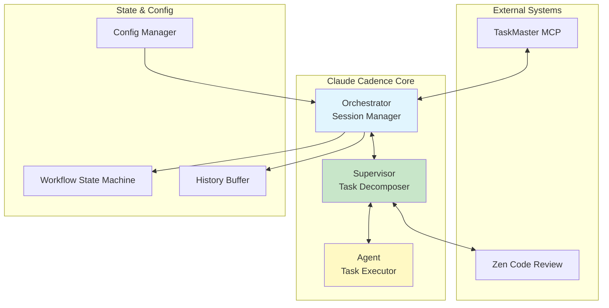
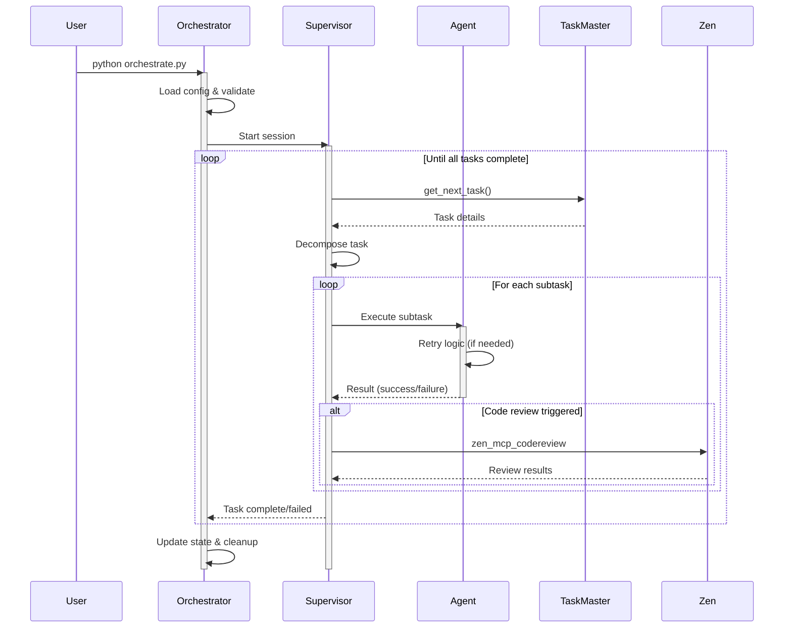
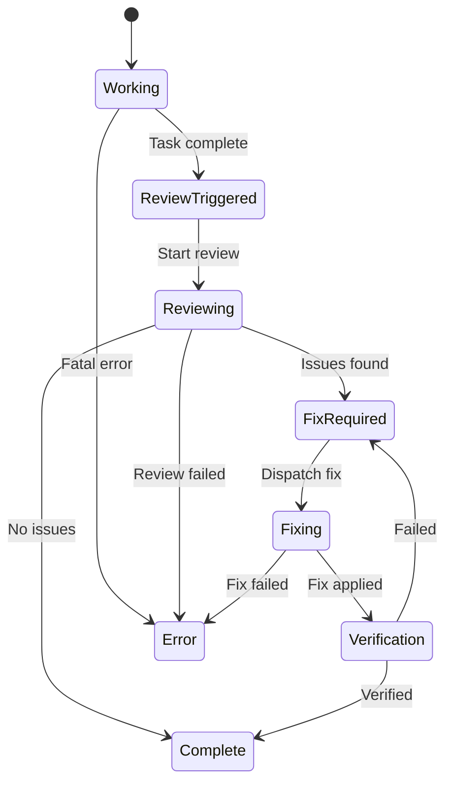
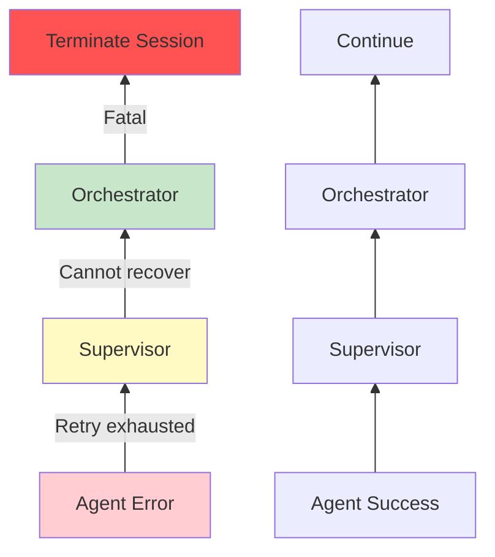
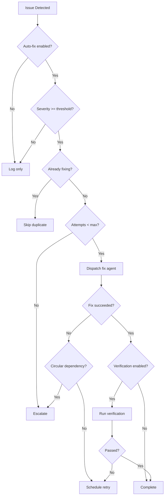
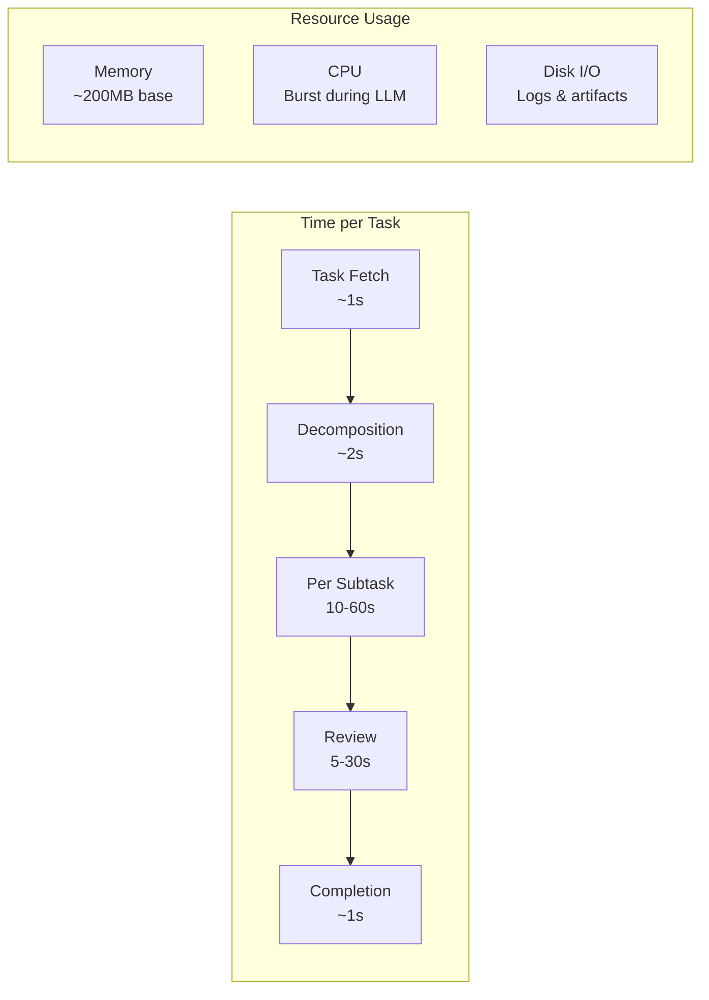
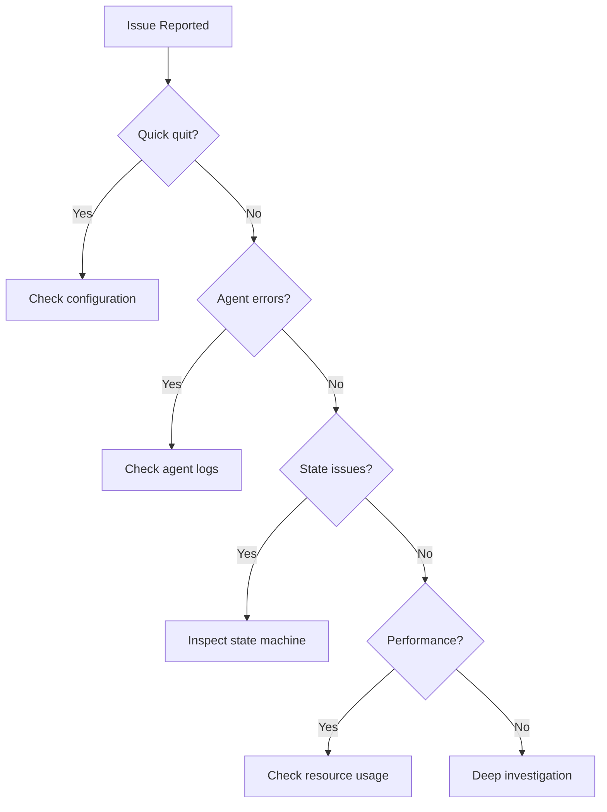

# Claude Cadence: Comprehensive Workflow & Architecture Documentation

**Version:** 2.0 (Post-Fix Update)
**Last Updated:** January 2025
**Audience:** Software Engineers, System Operators, Contributors

## Table of Contents

1. [System Architecture Overview](#1-system-architecture-overview)
2. [Core Design Philosophy](#2-core-design-philosophy)
3. [Workflow Execution Details](#3-workflow-execution-details)
4. [State Management & Persistence](#4-state-management--persistence)
5. [Error Handling & Recovery Strategy](#5-error-handling--recovery-strategy)
6. [Configuration Management](#6-configuration-management)
7. [Integration Points](#7-integration-points)
8. [Decision Trees & Logic Flows](#8-decision-trees--logic-flows)
9. [File System Artifacts Lifecycle](#9-file-system-artifacts-lifecycle)
10. [Performance & Resource Management](#10-performance--resource-management)
11. [Common Failure Patterns & Debugging](#11-common-failure-patterns--debugging)
12. [Operational Best Practices](#12-operational-best-practices)

---

## 1. System Architecture Overview

Claude Cadence is a **hierarchical task automation system** built on the principle of clear separation of concerns. The architecture implements a command-and-control pattern with three distinct layers, each with well-defined responsibilities.

### 1.1 Core Components



#### **Orchestrator** (Strategic Layer)
- **Purpose:** High-level session management and workflow coordination
- **Responsibilities:**
  - Initializes and manages session lifecycle
  - Maintains workflow state machine
  - Coordinates between Supervisor and Agent
  - Enforces configuration and resource limits
  - Handles fatal errors and session termination
- **Key Improvement:** Now the sole entry point (direct supervisor mode removed)

#### **Supervisor** (Tactical Layer)
- **Purpose:** Task analysis and work decomposition
- **Responsibilities:**
  - Fetches tasks from TaskMaster MCP
  - Breaks complex tasks into atomic subtasks
  - Validates Agent output
  - Triggers code reviews based on configuration
  - Manages retry logic for failed subtasks
- **Key Improvement:** Sends one task at a time to Agent (sequential execution)

#### **Agent** (Execution Layer)
- **Purpose:** Stateless task execution
- **Responsibilities:**
  - Executes single, well-defined subtasks
  - No awareness of overall project context
  - Reports success/failure with structured output
  - Manages local retry logic for transient failures
- **Key Improvement:** Configurable scratchpad retry logic

### 1.2 Communication Flow



---

## 2. Core Design Philosophy

The system is built on three fundamental principles:

### 2.1 **Fail Fast, Fail Explicitly**
- Invalid configurations terminate at startup
- Malformed data triggers immediate failure
- No silent error suppression

### 2.2 **Isolate Concerns**
- Each component has a single, clear responsibility
- State is managed at appropriate levels
- Dependencies flow downward only

### 2.3 **Expose Configuration**
- All key behaviors are configurable
- Sensible defaults with override capability
- Validation prevents invalid configurations

### 2.4 **Sequential Over Parallel**
The system prioritizes **predictability over performance**:
- One task at a time from Supervisor to Agent
- Simplified debugging and state management
- Deterministic execution order
- Trade-off: Lower throughput for higher reliability

---

## 3. Workflow Execution Details

### 3.1 Initialization Phase

```python
# Entry point (fixed in recent update)
python -m cadence  # or python orchestrate.py

# Initialization sequence:
1. Load base configuration from config.yaml
2. Apply CLI overrides (whitelisted keys only)
3. Validate final configuration
4. Create session directories
5. Initialize workflow state machine
```

**Key Improvements:**
- ✅ Fixed broken `__main__.py` entry point
- ✅ Whitelisted config overrides prevent injection of invalid keys
- ✅ Configuration loading refactored into small, testable helpers

### 3.2 Task Acquisition & Decomposition

```yaml
# Supervisor's task acquisition flow
1. Call TaskMaster MCP: get_next_task()
2. Receive task structure:
   {
     "id": "task-123",
     "title": "Implement user authentication",
     "subtasks": [
       {"id": "task-123.1", "title": "Create user model"},
       {"id": "task-123.2", "title": "Implement JWT tokens"},
       {"id": "task-123.3", "title": "Add login endpoint"}
     ]
   }
3. Process subtasks sequentially
```

### 3.3 The Review-Fix Cycle



### 3.4 Code Review Integration

Review frequency is controlled by `zen_review_frequency` in config:

| Setting | Behavior |
|---------|----------|
| `none` | No automated reviews |
| `task` | Review after each task completion |
| `project` | Review once at project completion |

---

## 4. State Management & Persistence

### 4.1 Workflow State Machine

The system maintains explicit state transitions with full history:

```python
# State transitions with metadata
{
    "from_state": "WORKING",
    "to_state": "REVIEW_TRIGGERED",
    "timestamp": "2025-01-28T10:30:00Z",
    "trigger": "task_complete",
    "metadata": {
        "task_id": "task-123",
        "subtasks_completed": 3,
        "execution_time": 425.3
    }
}
```

**Key Improvement:** ✅ Configurable history size via `workflow_max_history_size`

### 4.2 State Persistence Strategy

```yaml
# Three-tier state management
1. Transient State (Agent):
   - Scratchpad files
   - Retry counters
   - Cleared after subtask

2. Session State (Supervisor):
   - Current task decomposition
   - Subtask progress
   - Lasts for task duration

3. Persistent State (Orchestrator):
   - Workflow state machine
   - Session metadata
   - Bounded history buffer
```

### 4.3 Session Directory Structure

```
.cadence/
├── orchestrator_state.json      # Persistent orchestrator state
├── supervisor/
│   ├── decision_*.json         # Supervisor decisions
│   ├── agent_result_*.json     # Agent results
│   └── supervisor_*.log        # Supervisor logs
├── agent/
│   ├── prompt_*.txt           # Agent prompts
│   ├── output_*.log          # Agent stdout
│   └── error_*.log           # Agent stderr
├── scratchpad/
│   └── session_*.md          # Agent working notes
├── workflow_states/
│   └── {workflow_id}.json    # State machine persistence
└── dispatch/
    └── dispatch_*.log        # Dispatch system logs
```

---

## 5. Error Handling & Recovery Strategy

The system implements a **multi-layered error handling strategy**:

### 5.1 Layer 1: Local Retries (Transient Errors)

```yaml
# Agent-level retry for scratchpad creation
max_scratchpad_retries: 5  # Configurable
retry_delay: exponential_backoff
max_delay: 30s

# Example retry sequence:
Attempt 1: Immediate
Attempt 2: Wait 1s
Attempt 3: Wait 2s
Attempt 4: Wait 4s
Attempt 5: Wait 8s
Failed: Escalate to Supervisor
```

**Key Improvement:** ✅ Made retry count configurable via `max_scratchpad_retries`

### 5.2 Layer 2: Fail-Fast (Fatal Errors)

```python
# JSON buffer protection (recent fix)
if len(line) > MAX_LINE_LENGTH:  # 1MB per line
    raise ValueError(f"Line exceeds maximum length ({len(line)} > {MAX_LINE_LENGTH})")

if len(self.buffer) >= MAX_BUFFER_SIZE:  # 50K lines
    raise ValueError(f"JSON buffer size exceeded ({MAX_BUFFER_SIZE} lines)")
```

**Key Improvements:**
- ✅ JSON errors now fatal (no silent data corruption)
- ✅ Increased limits to handle large legitimate payloads
- ✅ Clear error messages for debugging

### 5.3 Error Propagation Chain



---

## 6. Configuration Management

### 6.1 Configuration Loading Hierarchy

```yaml
# Priority order (highest to lowest):
1. CLI arguments (whitelisted only)
2. Environment variables
3. config.yaml
4. Built-in defaults
```

### 6.2 Key Configuration Parameters

| Parameter | Type | Default | Description | Impact |
|-----------|------|---------|-------------|---------|
| `max_scratchpad_retries` | int | 5 | Agent retry attempts | Controls resilience vs. speed |
| `workflow_max_history_size` | int | 1000 | State transitions to keep | Memory usage vs. debugging detail |
| `quick_quit_seconds` | float | 10.0 | Quick failure detection | Catches config errors |
| `zen_review_frequency` | str | "task" | Code review trigger | Quality vs. performance |
| `max_concurrent_agents` | int | 2 | Parallel fix agents | Throughput vs. resource usage |
| `json_buffer_max_lines` | int | 50000 | JSON parser buffer | Large file support |
| `json_max_line_length` | int | 1000000 | Max line size (1MB) | Security vs. flexibility |

### 6.3 Configuration Validation

```python
# Whitelisted override example (recent security fix)
ALLOWED_OVERRIDES = {
    'max_scratchpad_retries': int,
    'workflow_max_history_size': int,
    'zen_review_frequency': ['none', 'task', 'project'],
    # ... other allowed keys
}

def override_from_args(self, args):
    for key, value in args.items():
        if key not in ALLOWED_OVERRIDES:
            raise ValueError(f"Override not allowed for key: {key}")
        # Type validation...
```

**Key Improvement:** ✅ Only whitelisted keys can be overridden at runtime

---

## 7. Integration Points

### 7.1 TaskMaster MCP Integration

```json
// Command: get_next_task
// Response:
{
    "task_id": "task-123",
    "title": "Implement feature X",
    "description": "Detailed requirements...",
    "subtasks": [...],
    "dependencies": ["task-122"],
    "metadata": {
        "priority": "high",
        "estimated_hours": 8
    }
}

// Command: update_task_status
// Request:
{
    "task_id": "task-123.1",
    "status": "completed",
    "notes": "Implemented with tests"
}
```

### 7.2 Zen Code Review Integration

```json
// Command: zen_mcp_codereview
// Request:
{
    "step": "Review authentication implementation",
    "step_number": 1,
    "total_steps": 3,
    "next_step_required": true,
    "findings": "Initial review of auth module",
    "relevant_files": [
        "/path/to/auth.py",
        "/path/to/tests/test_auth.py"
    ],
    "model": "gemini-2.5-pro"
}
```

---

## 8. Decision Trees & Logic Flows

### 8.1 Supervisor Decision Logic

```python
def make_decision(self, agent_result, task_status):
    # Quick-quit detection
    if agent_result.execution_time < self.config.quick_quit_seconds:
        return Decision(
            action="error",
            reason="Agent quit too quickly - likely configuration error"
        )

    # Scratchpad validation
    if not agent_result.scratchpad_exists:
        if self.retry_count < self.config.max_scratchpad_retries:
            return Decision(
                action="retry",
                reason="Scratchpad missing - retrying"
            )
        else:
            return Decision(
                action="error",
                reason="Max scratchpad retries exceeded"
            )

    # Task completion check
    if self.all_subtasks_complete():
        if self.should_trigger_review():
            return Decision(
                action="review",
                reason="Task complete - triggering code review"
            )
        else:
            return Decision(
                action="complete",
                reason="All subtasks completed successfully"
            )

    # Continue with next subtask
    return Decision(
        action="execute",
        subtask=self.get_next_subtask(),
        reason="Continuing with next subtask"
    )
```

### 8.2 Fix Dispatch Decision Tree



---

## 9. File System Artifacts Lifecycle

### 9.1 Session Initialization

```bash
# T=0: Session start
.cadence/
├── orchestrator_state.json (created/loaded)
└── project_complete.marker (deleted if exists)

# T=1: First iteration
.cadence/
├── supervisor/
│   └── supervisor_prompt_${session_id}.txt
├── agent/
│   └── prompt_${session_id}.txt
└── scratchpad/ (created)
```

### 9.2 Iteration Artifacts

Each supervisor-agent cycle creates:

```bash
# Per iteration files
supervisor/
├── decision_${session_id}.json      # Supervisor's decision
├── decision_snapshot_${session_id}.json  # Task breakdown
└── agent_result_${session_id}.json  # Agent outcome

agent/
├── prompt_${session_id}.txt         # Full agent prompt
├── output_${session_id}.log         # Stdout capture
└── error_${session_id}.log          # Stderr capture

scratchpad/
└── session_${session_id}.md         # Agent's working notes
```

### 9.3 Cleanup Policy

```python
# Automatic cleanup of old sessions
cleanup_keep_sessions: 5  # Keep last 5 sessions

# Manual cleanup
python orchestrate.py --cleanup  # Remove all session artifacts
```

---

## 10. Performance & Resource Management

### 10.1 Memory Management

| Component | Resource | Limit | Configurable |
|-----------|----------|-------|--------------|
| Workflow History | State transitions | 1000 entries | ✅ `workflow_max_history_size` |
| JSON Parser | Buffer lines | 50,000 | ❌ Hard-coded |
| JSON Parser | Line length | 1MB | ❌ Hard-coded |
| Agent Output | Log size | 50MB | ✅ `max_log_size` |
| Subprocess | Timeout | 300s | ✅ `subprocess_timeout` |

### 10.2 Concurrency Model

```yaml
# Sequential execution points (bottlenecks)
- Supervisor → Agent: One subtask at a time
- Task progression: Sequential by design
- State transitions: Single-threaded with lock

# Parallel execution points (performance)
- Fix agents: Up to max_concurrent_agents
- Dispatch system: Thread pool for fixes
- MCP calls: Can be parallelized (future)
```

### 10.3 Performance Characteristics



---

## 11. Common Failure Patterns & Debugging

### 11.1 Configuration Errors

**Symptom:** Process exits immediately (<10s)
**Cause:** Invalid model names, missing API keys, bad config
**Fix:** Check `error_${session_id}.log` for CLI errors
**Prevention:** Validate `config.yaml` before deployment

### 11.2 Persistent Agent Failures

**Symptom:** Agent retries exhausted on same subtask
**Cause:** Impossible task, missing tools, or bad instructions
**Debug:**
```bash
# Check agent's last attempt
cat .cadence/agent/output_${session_id}.log
cat .cadence/scratchpad/session_${session_id}.md

# Look for patterns
grep -i "error\|fail\|cannot" .cadence/agent/*.log
```

### 11.3 JSON Parse Failures

**Symptom:** `ValueError: Line exceeds maximum length`
**Cause:** Corrupted output or runaway process
**Fix:** Investigate source of large output
**Note:** These are now fatal (by design) to prevent silent corruption

### 11.4 State Machine Corruption

**Symptom:** Invalid state transitions, stuck workflows
**Debug:**
```python
# Interactive inspection
from cadence.workflow_state_machine import WorkflowStateManager
mgr = WorkflowStateManager()
wf = mgr.get_or_create_workflow("session_id")
print(wf.get_state_summary())
print(wf.transition_history[-5:])  # Last 5 transitions
```

### 11.5 Circular Fix Dependencies

**Symptom:** Same file modified repeatedly by fix agents
**Detection:** Built into `FixAgentDispatcher`
**Config:**
```yaml
circular_dependency:
  max_file_modifications: 3
  min_attempts_before_check: 2
```

---

## 12. Operational Best Practices

### 12.1 Pre-Production Checklist

- [ ] Validate `config.yaml` syntax
- [ ] Test API keys for all providers
- [ ] Set appropriate resource limits
- [ ] Configure log rotation
- [ ] Test cleanup scripts
- [ ] Document custom configurations

### 12.2 Monitoring Recommendations

```bash
# Key metrics to track
- Task completion rate
- Average subtask execution time
- Retry rates (scratchpad, fix agents)
- Error frequencies by type
- Memory usage over time
- Session duration distribution
```

### 12.3 Troubleshooting Workflow



### 12.4 Emergency Recovery

```bash
# Reset stuck session
rm .cadence/orchestrator_state.json
rm .cadence/workflow_states/${session_id}.json

# Force cleanup
find .cadence -name "*.log" -mtime +7 -delete

# Validate system health
python -m cadence --validate-config
python -m cadence --dry-run
```

---

## Appendix A: Configuration Schema

```yaml
# Complete config.yaml example with all options
execution:
  max_supervisor_turns: 80
  max_agent_turns: 120
  timeout: 600
  subprocess_timeout: 300
  max_scratchpad_retries: 5  # NEW

orchestration:
  supervisor_dir: ".cadence/supervisor"
  agent_dir: ".cadence/agent"
  max_iterations: 100
  quick_quit_seconds: 10.0
  workflow_max_history_size: 1000  # NEW

zen_integration:
  enabled: true
  code_review_frequency: "task"  # none|task|project
  primary_review_model: "gemini-2.5-pro"
  secondary_review_model: "o3"

agent:
  model: "claude-3-5-sonnet-20241022"
  tools: ["bash", "read", "write", "edit", "mcp"]
  use_continue: false

supervisor:
  model: "heuristic"
  use_continue: false

fix_agent_dispatcher:
  enable_auto_fix: true
  max_attempts: 3
  severity_threshold: "medium"
  circular_dependency:
    max_file_modifications: 3
    min_attempts_before_check: 2
```

---

## Appendix B: Recent Improvements Summary

| Fix | Impact | Configuration |
|-----|--------|---------------|
| Entry point repair | System can start reliably | N/A |
| Config validation | Prevents runtime surprises | Whitelist in code |
| Config refactoring | Maintainable codebase | N/A |
| Scratchpad retries | Handles transient failures | `max_scratchpad_retries` |
| History size limit | Prevents memory leaks | `workflow_max_history_size` |
| LSP violation fix | Proper inheritance | N/A |
| Fatal JSON errors | No silent corruption | Hard limits: 50K/1MB |

---

*This documentation reflects Claude Cadence v2.0 with all recent architectural improvements. For migration guides and API references, see the `/docs` directory.*
